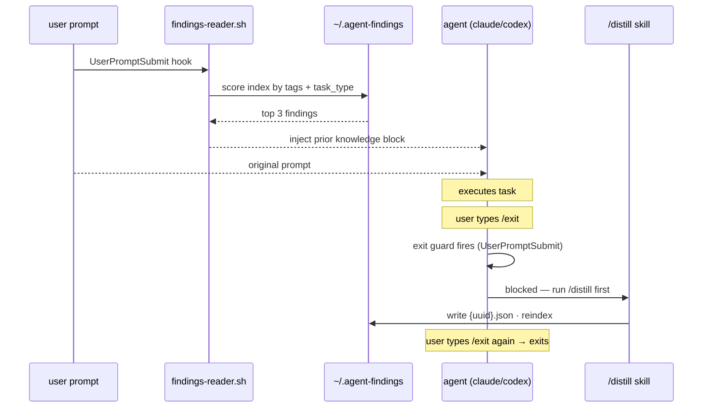

# agent-findings

**A cross-session collective-learning layer for Claude Code and Codex agents.**

Every agent starts with amnesia. It solves something, the session ends, and the lesson evaporates. The next agent relearns it from scratch.

agent-findings fixes that: after every task an agent writes down what it learned, before every task it reads back what past runs figured out. Both Claude Code and Codex write to and read from the same store.

> **Blog post:** [i gave my coding agents a shared memory](https://krish-shah.vercel.app/blog/2026-06-08-i-gave-my-agents-a-shared-memory)

---

## Install

Requires `jq`. On macOS: `brew install jq`. Distillation uses the agent CLI you already have installed — Claude Code (`claude`) or Codex. No separate API key needed.

**Claude Code**
```bash
curl -fsSL https://raw.githubusercontent.com/krish-shahh/agent-findings/main/install.sh | bash
```
Restart any running Claude Code sessions. That's it — both hooks register automatically.

**Codex** (after running the Claude Code install above)
```bash
git clone https://github.com/krish-shahh/agent-findings.git
cd agent-findings && ./install-codex.sh
```
Restart Codex and approve the two new hooks when prompted. Both agents now share the same `~/.agent-findings` store.

<details>
<summary>Manual / clone install</summary>

```bash
git clone https://github.com/krish-shahh/agent-findings.git
cd agent-findings
./install.sh          # Claude Code
./install-codex.sh    # Codex (optional)
```

To uninstall (findings are kept): `./uninstall.sh`
</details>

---

## How it works



- **`findings-reader.sh`** — before every prompt, scores the store by keyword overlap against `task_type` and `tags`, injects the top 3 as a prior-knowledge block. Pure shell + `jq`, nothing slow.
- **`findings-exit-guard.sh`** — intercepts `/exit` and `/quit` when `AGENT_FINDINGS_ENABLED=1`. Blocks until the session is distilled, then lets the exit through.
- **`/distill` skill** — Claude extracts a finding from the current session in-session (no extra model call, uses your active subscription), writes it to the store, and unblocks exit.

---

## The finding

One JSON file. One reusable lesson. The schema is the protocol — anything that writes this shape interoperates.

```jsonc
{
  "schema_version": "1.0",
  "id": "7c2a1e90-4b3d-4f1a-9c2e-0a1b2c3d4e5f",
  "task_type": "debugging",          // kebab-case — the retrieval key
  "language": "python",
  "what_worked": "the flaky test was a clock dependency. injecting a clock made it deterministic.",
  "what_failed": "spent 20 min adding retries assuming a network race — re-running 'until green' hid the non-determinism.",
  "better_exit_condition": "a test that passes on retry but fails in isolation means non-determinism in the code, not the harness.",
  "tags": ["flaky-test", "pytest", "non-determinism"],
  "confidence": 0.86,                // below 0.5 is never stored
  "timestamp": "2026-06-08T22:00:00Z",
  "source": { "agent": "claude-code", "session_id": "…", "cwd": "…" }
}
```

Full schema: [`schema/finding.schema.json`](schema/finding.schema.json) · Example: [`examples/`](examples/example-finding.json)

**Protocol rules:** one finding per file, immutable, append-only, confidence-gated. `index.json` and `stats.json` are caches — `agent-findings reindex` rebuilds them from the files at any time. Because findings are UUID-addressed and immutable, **merging two stores is a set union** — no conflicts, ever.

---

## Store layout

```
~/.agent-findings/
├── index.json              # tag index + finding summaries (cache)
├── findings/
│   └── {task_type}/
│       └── {uuid}.json     # source of truth
└── meta/
    ├── stats.json
    ├── writer.log
    ├── current-session     # session_id of the active session (written by SessionStart hook)
    └── distilled-{sid}     # sentinel: this session was distilled (unblocks /exit)
```

---

## CLI

```bash
agent-findings list [N]        # recent findings (default 10)
agent-findings show <id>       # full finding by id or prefix
agent-findings search <query>  # find by keyword
agent-findings delete <id>     # remove a finding
agent-findings stats           # totals, top task types, top tags
agent-findings reindex         # rebuild index from files
agent-findings sync            # push/pull with a shared remote (stub)
```

---

## Sync

The data model is built for sharing. Findings are immutable and UUID-addressed, so merging two stores is a set union of `{uuid}.json` files — no conflicts.

`agent-findings sync` is a documented stub. You can DIY today:

```bash
git -C ~/.agent-findings init
git -C ~/.agent-findings add findings
git -C ~/.agent-findings commit -m "findings"
git -C ~/.agent-findings remote add origin <url> && git -C ~/.agent-findings push -u origin main
```

Planned: `agent-findings sync push/pull` against a shared git remote.

---

## Distillation (opt-in)

Distillation is the step where findings actually get written — Claude reads what happened in the session and extracts a structured lesson. It runs **entirely in-session** via the `/distill` skill, so it uses your active subscription and costs nothing extra.

**Distillation is off by default.** Set `AGENT_FINDINGS_ENABLED=1` to enable the exit guard, which prompts you to distill before each `/exit`.

```bash
echo 'export AGENT_FINDINGS_ENABLED=1' >> ~/.zshrc  # or ~/.bashrc
```

**The exit flow when enabled:**

```
user:  /exit
guard: agent-findings: session not yet distilled.
       Run /distill to save what you learned, then /exit again.

user:  /distill
claude: [reads session context, structures finding, writes JSON, rebuilds index]
claude: "Finding saved (api-integration · 0.82). You can now /exit."

user:  /exit   ← guard sees sentinel, exits cleanly
```

To skip distillation for a session: set `AGENT_FINDINGS_ENABLED=0` temporarily, or just type `/exit` twice (the guard message tells you how).

The `findings-writer.sh` Stop hook is also present but is a no-op unless `AGENT_FINDINGS_ENABLED=1` — it exists for Codex compatibility where the `/distill` skill isn't available. For Codex users, the Stop hook calls `claude -p` for distillation; starting June 15 2026, `claude -p` draws from Agent SDK credits rather than your subscription, so Codex distillation has a small per-session cost.

---

## Configuration

| Variable | Default | Effect |
|---|---|---|
| `AGENT_FINDINGS_ENABLED` | unset | Set to `1` to enable distillation (opt-in, see above) |
| `AGENT_FINDINGS_HOME` | `~/.agent-findings` | Store location |
| `AGENT_FINDINGS_TOP_N` | `3` | Findings injected per prompt |
| `AGENT_FINDINGS_TRANSCRIPT_BYTES` | `60000` | Transcript cap for distiller |
| `CODEX_CLI` | `/Applications/Codex.app/…/codex` | Override Codex CLI path |

---

## Contributing

A finding is just a JSON file. Write the same shape from Cursor, Aider, Codex, a CI job, or your own agent and it drops straight into any store. See [CONTRIBUTING.md](CONTRIBUTING.md).

## License

MIT — see [LICENSE](LICENSE).
