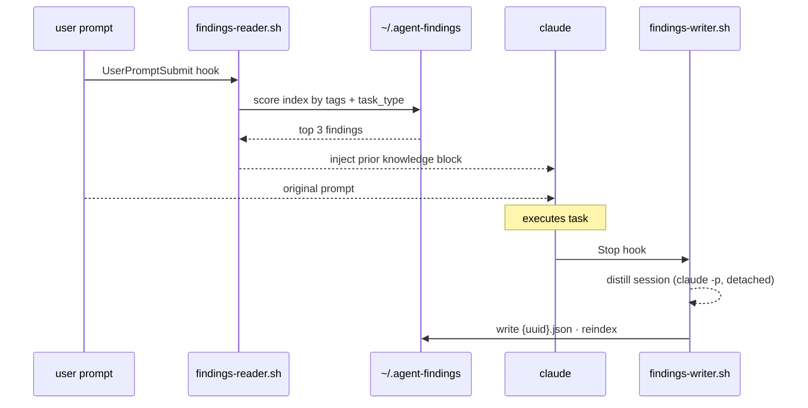

# agent-findings

**A cross-session, cross-project collective-learning layer for coding agents.**

Every time an agent finishes a task it learns something — a trick that worked, a
dead end that wasted twenty minutes, a better signal for "I'm actually done."
Today that knowledge dies when the session ends. The next agent, on the next
task, in the next repo, starts from zero and re-learns the same lesson.

`agent-findings` fixes that with two hooks and a folder of JSON:

- **After** a task, a hook distills what the agent learned into a structured
  **finding** and appends it to a shared local store.
- **Before** a task, a hook retrieves the most relevant prior findings and
  injects them as a *prior-knowledge* block the agent reads naturally.

Run it for a week and `~/.agent-findings` becomes a compounding knowledge base
that any agent can contribute to and benefit from. Point many machines at one
shared store (see [The sync layer](#the-sync-layer)) and it becomes a
*community* knowledge base.

It is deliberately boring underneath: **shell scripts and plain JSON, no
runtime, no database, no service.** The schema is the product — everything else
is a reference implementation.

---

## How it works



- **`findings-reader.sh`** (pre-task / `UserPromptSubmit`) — tokenizes the
  prompt, scores every finding by keyword overlap against its `task_type` and
  `tags`, breaks ties by `confidence`, and injects the top 3.
- **`findings-writer.sh`** (post-task / `Stop`) — detaches a background worker
  that runs a distillation prompt (`claude -p`) over the session transcript,
  validates the result against the schema, drops anything below
  `confidence ≥ 0.5`, and writes the survivor to the store.

The writer runs **detached** — your session never waits on it. The reader is
pure shell + `jq` — no network, no embeddings, nothing to slow a prompt down.

---

## The finding — the core artifact

A **finding** is one JSON file: one reusable lesson from one task. It is the
whole protocol. Anything that reads or writes this shape interoperates,
regardless of which agent or language produced it.

```jsonc
{
  "schema_version": "1.0",
  "id": "7c2a1e90-4b3d-4f1a-9c2e-0a1b2c3d4e5f",  // UUID v4, also the filename
  "task_type": "debugging",                       // kebab-case, small vocabulary, the retrieval key
  "language": "python",                           // or "none" / "multiple"
  "what_worked": "The flaky test was a clock dependency, not a network race. Injecting a clock made it deterministic.",
  "what_failed": "Spent 20 min adding retries assuming a race — re-running 'until green' hid the real non-determinism.",
  "better_exit_condition": "A test that passes on retry but fails in isolation means non-determinism in the code, not the harness. Don't stop until it's 20/20 in isolation.",
  "tags": ["flaky-test", "pytest", "datetime", "non-determinism"],
  "confidence": 0.86,                             // 0..1 — below 0.5 is never stored
  "timestamp": "2026-06-08T22:00:00Z",            // ISO 8601 UTC
  "source": { "agent": "claude-code", "session_id": "…", "cwd": "…" }
}
```

| Field | Why it exists |
|---|---|
| `task_type` | Primary retrieval shard. Keep the vocabulary small and reused so findings cluster. |
| `what_worked` | The actionable win. Concrete enough that a future agent can just *do* it. |
| `what_failed` | Often the most valuable field — it lets the next agent skip the mistake entirely. |
| `better_exit_condition` | The signal that should have ended (or unstuck) the task sooner. Directly targets agent over/under-running. |
| `tags` | Orthogonal index to `task_type`, for cross-task retrieval. |
| `confidence` | Self-assessed reliability/generality. The store's quality gate. |

The authoritative, validatable definition is
[`schema/finding.schema.json`](schema/finding.schema.json) (JSON Schema
draft-07). A worked example is in [`examples/`](examples/example-finding.json).

### Design rules of the protocol

1. **One finding per file.** Files are immutable and content-addressed by UUID.
2. **Append-only.** You never edit a finding; you write a new one.
3. **Confidence-gated.** Below `0.5` is noise and is discarded at write time.
4. **Flat and human-readable.** Plain JSON, no nesting beyond `source`, greppable.
5. **The store is derived, the findings are the source of truth.** `index.json`
   and `stats.json` are caches — `agent-findings reindex` rebuilds them from the
   `findings/` files at any time.

Because findings are immutable and UUID-addressed, **merging two stores is a set
union** — drop the files together and reindex. No conflicts. That property is
what makes the sync layer trivial.

---

## Store layout

```
~/.agent-findings/
├── index.json              # task_type registry + tag index + finding summaries (cache)
├── findings/
│   └── {task_type}/
│       └── {uuid}.json     # the findings themselves (source of truth)
└── meta/
    ├── stats.json          # totals, top task types, top tags, last write/sync
    └── writer.log          # background distiller log (debugging)
```

Everything lives under `~/.agent-findings`, so it is global across every project
on the machine. Nothing project-specific is written into your repos.

---

## Install

Requires **`jq`** and the **`claude`** CLI. On macOS: `brew install jq`.

```bash
curl -fsSL https://raw.githubusercontent.com/krish-shahh/agent-findings/main/install.sh | bash
```

Or clone if you want to browse or modify the scripts first:

```bash
git clone https://github.com/krish-shahh/agent-findings.git
cd agent-findings
./install.sh
```

`install.sh` is idempotent and:

1. creates and seeds `~/.agent-findings`,
2. installs both hooks into `~/.claude/hooks`,
3. installs the `agent-findings` CLI into `~/.local/bin`,
4. registers the hooks in `~/.claude/settings.json` — **merging**, never
   overwriting, and writing a timestamped backup first.

Restart any running Claude Code sessions to pick up the hooks. To register the
hooks by hand instead, copy the `hooks` block from
[`.claude/settings.example.json`](.claude/settings.example.json) into your
`~/.claude/settings.json`.

Remove everything (findings are kept) with `./uninstall.sh`.

---

## CLI

```bash
agent-findings list [N]        # recent findings (default 10)
agent-findings show <id>       # full finding by id or id-prefix
agent-findings search <query>  # find findings matching a query string
agent-findings delete <id>     # remove a finding by id or id-prefix
agent-findings stats           # store statistics
agent-findings reindex         # rebuild index.json + stats.json from the files
agent-findings sync            # share with a remote store (stub — see below)
agent-findings help
```

```text
$ agent-findings list 3
ID        TASK_TYPE           LANGUAGE      CONF   TIMESTAMP
--------  ------------------  ------------  -----  -------------------
7c2a1e90  debugging           python        0.86   2026-06-08T22:00:00Z
1f4b3c20  refactor            typescript    0.74   2026-06-08T19:11:42Z
9a0d5e11  api-integration     go            0.81   2026-06-07T15:02:09Z
```

---

## Configuration

Environment variables (set in your shell or Claude Code env):

| Variable | Default | Effect |
|---|---|---|
| `AGENT_FINDINGS_HOME` | `~/.agent-findings` | Store location. Point several machines at one shared/synced dir. |
| `AGENT_FINDINGS_TOP_N` | `3` | How many prior findings the reader injects. |
| `AGENT_FINDINGS_TRANSCRIPT_BYTES` | `60000` | Cap on transcript bytes fed to the distiller. |

---

## The sync layer

A local store is useful. A *shared* store is the point — that is when agents
learn from each other across people and machines.

The data model is already built for it. Findings are **immutable and
content-addressed by UUID**, so synchronizing two stores is a **set union of
`{uuid}.json` files** followed by a reindex. There are no edits, so there are no
merge conflicts — ever.

`agent-findings sync` is currently a documented stub. The planned interface:

```bash
agent-findings sync --remote git@github.com:org/team-findings.git   # link a shared repo
agent-findings sync pull     # union the community's findings into your store, reindex
agent-findings sync push     # publish your local findings upward
```

The first backend is intentionally the dumbest thing that works: **a git repo of
`findings/`**. `pull` is `git pull` + `reindex`; `push` is `git add/commit/push`.
You can do it by hand today:

```bash
git -C ~/.agent-findings init
git -C ~/.agent-findings add findings
git -C ~/.agent-findings commit -m "findings"
git -C ~/.agent-findings remote add origin <url> && git -C ~/.agent-findings push -u origin main
```

Later backends (an HTTP index, signed contributions, quality voting, dedup by
semantic similarity) can layer on without changing the on-disk finding — that is
the whole reason the finding, not the transport, is the protocol.

---

## Contributing

Two things are worth more than anything else:

1. **Other producers and consumers.** A finding is just a JSON file. Write the
   same shape from Cursor, Aider, a CI job, your own agent — and it drops
   straight into any store. New language? Port the two hooks; keep the schema
   byte-for-byte.
2. **Schema evolution.** Propose changes as PRs against
   [`schema/finding.schema.json`](schema/finding.schema.json). Add fields under
   `source` freely (it is open). Changing or removing a top-level field is a
   `schema_version` bump — consumers must tolerate unknown minor versions.

Guidelines: keep the core runtime-free (shell + `jq`), keep findings immutable
and append-only, and never let the hooks block a session. Bug reports and
real-world findings dumps welcome.

## License

MIT — see [LICENSE](LICENSE).
